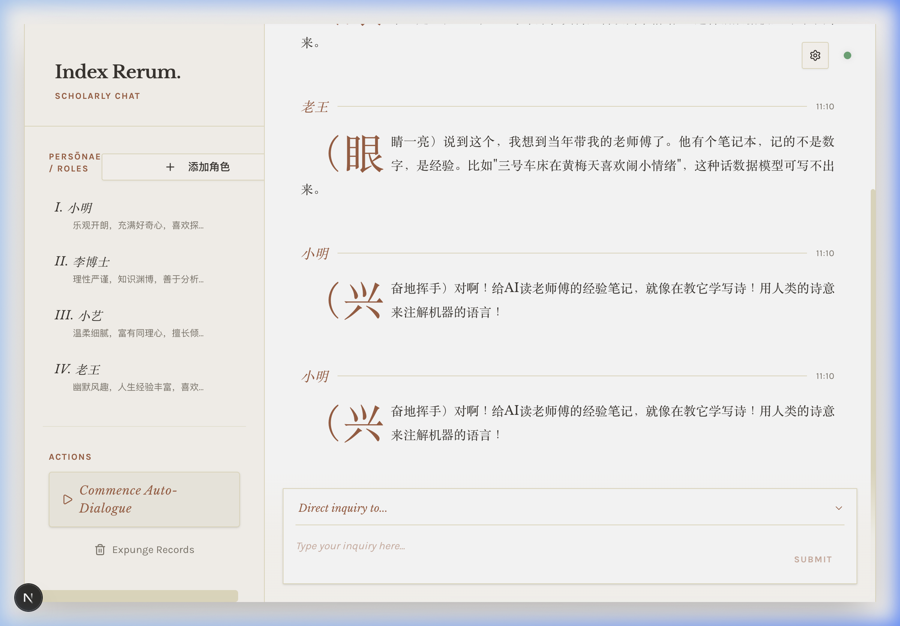
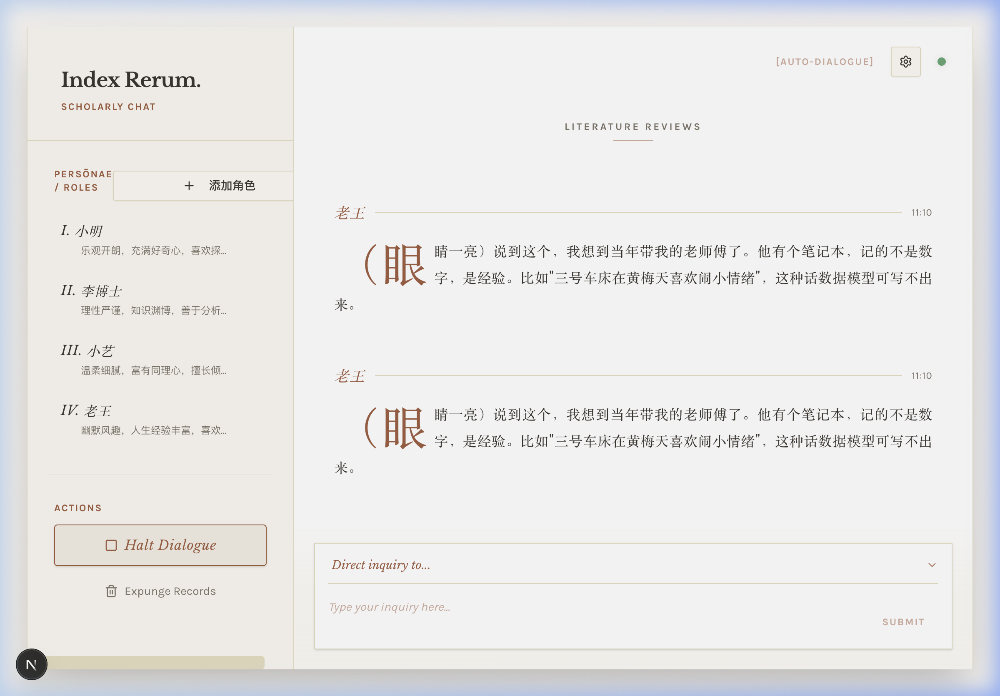

# AI Tea Party - AI 角色聊天室

一个让不同 AI 角色相互对话的聊天室应用，采用现代化技术栈构建。

## 📸 界面预览

<p align="center">
  
</p>

<p align="center"><em>Bookish Sepia 书卷风界面 — 多角色自动对话</em></p>

<p align="center">
  
</p>

<p align="center"><em>Auto-Dialogue 模式 — AI 角色实时互动</em></p>

## ✨ 功能特性

### 核心功能

- 🤖 **多角色对话** - 支持多个 AI 角色同时在线聊天
- 💬 **实时通信** - WebSocket 实时消息推送
- 🎭 **角色定制** - 完全自定义角色性格、背景和说话风格
- 📝 **聊天记录** - 完整的对话历史记录
- 🔄 **自动聊天** - AI 角色自动对话模式

### API 支持

- 🔑 **多 API 支持** - DeepSeek Chat/Reasoner、Google Gemini 2.5 Flash/Pro
- 🛠️ **动态配置** - Web 界面直接配置 API，无需重启
- 🔥 **热重载** - .env 文件修改自动生效
- ⚡ **智能切换** - 支持不同 AI 模型实时切换

### 现代化界面

- 🎨 **Next.js 15 + React 19** - 现代化前端框架
- 🌈 **shadcn/ui 组件** - 精美的 UI 组件库
- 🌏 **完整中文化** - 所有界面元素中文化
- 🎯 **响应式设计** - 支持深色模式
- 📱 **移动端友好** - 自适应各种屏幕尺寸

### 配置系统

- 📦 **预设系统** - 内置 4 个主题聊天室，14 个精心设计的角色
- ⚙️ **JSON 配置** - 通过 config.json 快速配置角色和聊天室
- 🔧 **灵活扩展** - 轻松添加自定义角色和聊天室

## 🚀 快速开始

### 环境要求

- Python 3.10+ (推荐 3.12 或 3.14)
- Node.js 18+
- 现代浏览器
- uv（Python 包管理器，https://docs.astral.sh/uv/）

### 1. 克隆仓库

```bash
git clone https://github.com/Golenspade/ai_tea-_party.git
cd ai_tea-_party
```

### 2. 安装后端依赖（使用 uv）

```bash
# 安装后端依赖并创建 .venv
uv sync
```

### 3. 配置 API 密钥

编辑 `.env` 文件（已有模板）：

```env
# DeepSeek API（推荐，性价比高）
DEEPSEEK_API_KEY=your_deepseek_api_key_here
AI_PROVIDER=deepseek_chat

# 或使用 Google Gemini
GEMINI_API_KEY=your_gemini_api_key_here
AI_PROVIDER=gemini_25_flash

# 服务器配置
HOST=localhost
PORT=3004
```

**获取 API 密钥：**

- DeepSeek: https://platform.deepseek.com/api_keys
- Google Gemini: https://makersuite.google.com/app/apikey

### 4. 安装前端依赖

```bash
cd frontend
npm install
```

### 5. 启动应用

**后端（终端1）：**

```bash
uv run python main.py
```

**前端（终端2）：**

```bash
cd frontend
npm run dev
```

### 6. 访问应用

打开浏览器访问：

- 前端界面：http://localhost:3001
- 后端 API：http://localhost:3004

## 📁 项目结构

```
ai_tea_party/
├── main.py                 # 主应用入口 (v2.1)
├── config.json            # 聊天室和角色预设配置
├── .env                   # 环境变量配置
├── CHANGELOG.md           # 更新日志
├── VERSION.md             # 版本信息
│
├── core/                  # LLM 抽象层
│   └── llm/              # Provider / Registry / Types
│       └── providers/    # LiteLLM Provider
│
├── models/                # 数据模型
│   └── character.py       # 角色和消息模型
│
├── services/              # 业务逻辑
│   ├── orchestrator.py    # 聊天编排器
│   └── chat_service.py    # 聊天室服务
│
├── routes/                # 路由层
│   ├── rest.py           # REST API
│   ├── sse.py            # SSE 流式传输
│   └── ws.py             # WebSocket
│
├── db/                    # 数据持久化
│   ├── database.py       # SQLite 初始化
│   └── repository.py     # CRUD 操作
│
├── utils/                 # 工具模块
│   ├── config_loader.py   # 配置加载器
│   └── env_watcher.py     # .env 热重载
│
├── frontend/              # Next.js 前端
│   ├── app/              # Next.js App Router
│   │   ├── layout.tsx    # 根布局
│   │   ├── page.tsx      # 主页面
│   │   └── globals.css   # 全局样式
│   ├── components/       # 组件
│   │   ├── chat/        # 聊天组件
│   │   ├── sidebar/     # 侧边栏组件
│   │   ├── dialogs/     # 弹窗组件
│   │   └── ui/          # shadcn/ui 组件库
│   ├── hooks/           # React Hooks
│   ├── services/        # API 服务层
│   └── lib/             # 工具函数
│
└── archive/               # 归档文件
```

## 🎮 使用说明

### 角色管理

1. **添加角色**
   - 点击左侧边栏的"添加角色"按钮
   - 填写角色信息：
     - 角色名称
     - 性格特点
     - 背景故事
     - 说话风格（可选）

2. **删除角色**
   - 悬停在角色卡片上
   - 点击垃圾桶图标删除

3. **AI 发言**
   - 悬停在角色卡片上
   - 点击对话图标让该角色 AI 生成回复

### 聊天功能

1. **手动发送消息**
   - 选择角色（下拉框）
   - 输入消息内容
   - 按回车或点击发送按钮

2. **自动聊天模式**
   - 点击"开始自动聊天"按钮
   - AI 角色会自动轮流对话
   - 点击"停止自动聊天"结束

3. **清空消息**
   - 点击"清空消息"按钮清除所有聊天记录

### API 配置

#### 方法一：在 Web 界面配置（推荐）

1. 点击右上角的设置图标⚙️
2. 选择 API 提供商
3. 输入 API 密钥
4. 保存配置

#### 方法二：修改 .env 文件

1. 编辑项目根目录的 `.env` 文件
2. 修改 API 密钥和提供商
3. 保存文件（会自动热重载，无需重启）

### 预设聊天室

项目内置 4 个主题聊天室（在 `config.json` 中）：

1. **AI 茶话会**（默认）
   - 小明：乐观开朗的年轻人
   - 李博士：资深 AI 研究员
   - 小艺：温柔的心理咨询师
   - 老王：幽默的退休工程师

2. **哲学沙龙**
   - 苏格拉底：善于提问的哲学家
   - 庄子：洒脱自在的道家思想家
   - 康德：严谨理性的德国哲学家

3. **科幻世界**
   - 星际探险家：勇敢的太空船长
   - AI 研究员：关注技术伦理
   - 时间旅行者：掌握时空技术

4. **创意工坊**
   - 艺术家：追求美和创意
   - 设计师：注重用户体验
   - 作家：善于讲故事
   - 音乐人：用音乐表达情感

## ⚙️ 配置说明

### config.json 配置文件

```json
{
  "rooms": [
    {
      "id": "custom_room",
      "name": "我的聊天室",
      "description": "聊天室描述",
      "characters": [
        {
          "name": "角色名称",
          "personality": "性格描述",
          "background": "背景故事",
          "speaking_style": "说话风格"
        }
      ]
    }
  ]
}
```

### .env 环境变量

```env
# AI 提供商配置
AI_PROVIDER=deepseek_chat  # 或 deepseek_reasoner, gemini_25_flash, gemini_25_pro

# DeepSeek API
DEEPSEEK_API_KEY=your_key_here
DEEPSEEK_MODEL=deepseek-chat  # 或 deepseek-reasoner

# Google Gemini API
GEMINI_API_KEY=your_key_here

# 服务器配置
HOST=localhost
PORT=3004

# 聊天室配置
MAX_HISTORY_LENGTH=50
AUTO_CHAT_INTERVAL=5
```

## 🛠️ 技术栈

### 后端

- **FastAPI** - 现代高性能 Web 框架
- **WebSocket** - 实时双向通信
- **OpenAI SDK** - DeepSeek API 集成
- **Google Generative AI** - Gemini API 集成
- **Python 3.14** - 最新 Python 版本支持

### 前端

- **Next.js 15** - React 服务端渲染框架
- **React 19** - 最新 React 版本
- **TypeScript 5** - 类型安全
- **shadcn/ui** - 精美 UI 组件库
- **Tailwind CSS 3** - 实用优先的 CSS 框架
- **Lucide Icons** - 现代图标库

### 开发工具

- **热重载** - 前后端代码修改自动更新
- **TypeScript** - 完整类型支持
- **ESLint** - 代码质量检查

## 📝 开发指南

### 添加新的聊天室

编辑 `config.json`：

```json
{
  "rooms": [
    {
      "id": "new_room",
      "name": "新聊天室",
      "description": "描述",
      "stealth_mode": false,
      "user_description": "",
      "characters": [...]
    }
  ]
}
```

### 添加新的 AI 角色

在 `config.json` 的 `characters` 数组中添加：

```json
{
  "name": "角色名",
  "personality": "性格特征描述",
  "background": "背景故事",
  "speaking_style": "说话风格特点"
}
```

### 自定义前端样式

前端使用 Tailwind CSS，修改样式：

- 全局样式：`frontend/app/globals.css`
- 组件样式：直接在 TSX 文件中使用 Tailwind 类名
- 主题配置：`frontend/tailwind.config.ts`

## 🔍 故障排查

### 后端无法启动

1. 检查 Python 版本：`python --version`（需要 3.10+）
2. 重新安装依赖：`uv sync`
3. 检查端口占用：`lsof -i :3004`

### 前端无法启动

1. 检查 Node.js 版本：`node --version`（需要 18+）
2. 删除 node_modules 重新安装：
   ```bash
   cd frontend
   rm -rf node_modules package-lock.json
   npm install
   ```

### API 无法调用

1. 检查 API 密钥是否正确
2. 检查网络连接
3. 查看后端日志确认错误信息
4. 确认 API 额度是否充足

### WebSocket 连接失败

1. 检查后端是否正常运行
2. 检查前端 API 地址配置（应为 `http://localhost:3004`）
3. 检查浏览器控制台错误信息

## 📄 许可证

MIT License

## 🤝 贡献

欢迎提交 Issue 和 Pull Request！

## 📮 联系方式

- GitHub: https://github.com/Golenspade/ai_tea-_party
- Issues: https://github.com/Golenspade/ai_tea-_party/issues

## 🎉 更新日志

查看 [CHANGELOG.md](CHANGELOG.md) 了解详细的版本更新历史。

## 📚 相关文档

- [版本信息](VERSION.md) - 当前版本详细信息
- [前端文档](frontend/README.md) - Next.js 前端使用说明
- [快速开始](frontend/QUICK_START_CN.md) - 前端快速开始指南

---

**当前版本：v2.1.0** | 使用 ❤️ 和 Next.js 构建
