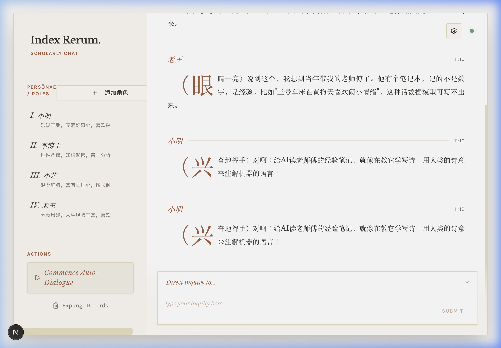
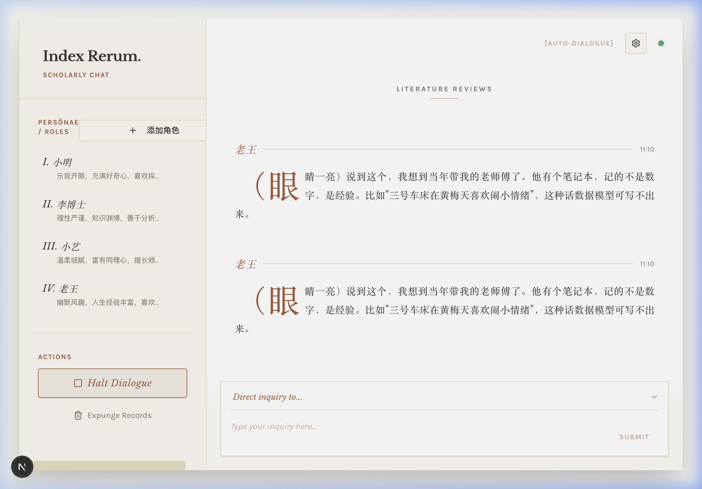

# AI Tea Party - AI 角色聊天室

一个让不同 AI 角色相互对话的聊天室应用，采用现代化技术栈构建。

## 📸 界面预览

<p align="center">
  
</p>

<p align="center"><em>Bookish Sepia 书卷风界面 — 多角色自动对话</em></p>

<p align="center">
  
</p>

<p align="center"><em>Auto-Dialogue 模式 — AI 角色实时互动</em></p>

## ✨ 功能特性

### 核心功能

- 🤖 **多角色对话** — 多个 AI 角色同时在线聊天
- 💬 **实时通信** — WebSocket 推送消息、Patch、Ask、形势栏更新
- 🎭 **角色定制** — 性格、背景、说话风格、示例对话
- 📝 **持久化** — SQLite 保存房间、角色、消息与变量
- 🔄 **自动聊天** — DM 调度下一发言者，角色轮流对话

### Agent 平台能力

- ❓ **Ask** — Agent 暂停叙事，侧栏询问用户，SSE 续跑
- ✍️ **Write to Room / Bar** — Agent Tool 写入消息与形势栏
- 📝 **Patch Room** — 修改已有 AI/旁白消息，前端高亮 diff
- 📊 **变量系统** — room/global 变量、条件分支、Gauge 可视化
- 📦 **Archive / Compact** — 房间归档与摘要压缩，支持长剧情
- 📈 **Mermaid** — 消息内 Mermaid 图表渲染

### API 支持

- 🔑 **多模型** — DeepSeek、Gemini 等（经 Pi Agent / pi-ai）
- 🛠️ **Web 配置** — 界面选择 Provider 与模型
- ⚡ **SSE 流式** — 实时 token 输出与 Tool 事件

### 现代化界面

- 🎨 **Next.js 15 + React 19** - 现代化前端框架
- 🌈 **shadcn/ui 组件** - 精美的 UI 组件库
- 🌏 **完整中文化** - 所有界面元素中文化
- 🎯 **响应式设计** - 支持深色模式
- 📱 **移动端友好** - 自适应各种屏幕尺寸

### 配置系统

- 📦 **预设系统** - 内置 4 个主题聊天室，14 个精心设计的角色
- ⚙️ **JSON 配置** - 通过 config.json 快速配置角色和聊天室
- 🔧 **灵活扩展** - 轻松添加自定义角色和聊天室

## 🚀 快速开始

### 环境要求

- Node.js 20+
- pnpm 10+
- 现代浏览器

### 1. 克隆仓库

```bash
git clone https://github.com/Golenspade/ai_tea-_party.git
cd ai_tea-_party
```

### 2. 安装依赖

```bash
pnpm install
```

### 3. 配置 API 密钥

编辑 `.env` 文件（已有模板）：

```env
# DeepSeek API（推荐，性价比高）
DEEPSEEK_API_KEY=your_deepseek_api_key_here

# 或使用 Google Gemini
GEMINI_API_KEY=your_gemini_api_key_here

# 服务器配置
HOST=localhost
PORT=3004
```

**获取 API 密钥：**

- DeepSeek: https://platform.deepseek.com/api_keys
- Google Gemini: https://makersuite.google.com/app/apikey

### 4. 启动应用

在项目根目录一条命令启动前端 + TypeScript 后端：

```bash
pnpm dev
```

### 5. 访问应用

打开浏览器访问：

- 前端界面：http://localhost:3000
- 后端 API：http://localhost:3004
- E2E 默认以 `localhost:3001` 启动前端（见 `docs/E2E_TEST_SKILL.md` 与 `frontend/playwright.config.ts`）。

### 6. 运行测试

```bash
pnpm test    # backend 单元测试 + frontend Vitest
pnpm lint    # TypeScript 类型检查
pnpm build   # 构建各包
```

### 7. E2E 测试（建议）

Playwright E2E 需 backend 在 3004 运行。推荐先 `pnpm dev`，再在另一终端：

```bash
pnpm --filter ai-tea-party-frontend e2e:smoke   # 冒烟
pnpm --filter ai-tea-party-frontend e2e         # 全量
pnpm --filter ai-tea-party-frontend e2e:ui      # UI 模式
```

详见 [`docs/E2E_TEST_SKILL.md`](docs/E2E_TEST_SKILL.md)。

## 📁 项目结构

```
ai_tea_party/
├── package.json            # monorepo 根脚本（pnpm dev / test）
├── pnpm-workspace.yaml
├── config.json             # 聊天室和角色预设配置
├── .env                    # 环境变量配置
├── data/tea_party.db       # SQLite（运行时生成）
│
├── backend/                # TypeScript 后端（Fastify + Pi Agent）
│   └── src/
│       ├── index.ts        # 入口
│       ├── store.ts        # 业务状态中枢
│       ├── db/             # Drizzle + SQLite
│       ├── routes/         # REST / SSE / WebSocket
│       └── services/       # Agent 编排、Ask、Archive 等
│
├── packages/shared/        # 前后端共享 Zod 类型
│
├── frontend/               # Next.js 前端
│   ├── app/                # App Router
│   ├── components/         # chat / sidebar / dialogs / ui
│   ├── hooks/              # WebSocket 等
│   ├── services/           # api.ts 等
│   └── lib/                # 类型与工具
│
└── docs/plans/             # 产品路线图与 Phase 计划
```

> Python 后端及依赖配置（`main.py`、`pyproject.toml` 等）已全部移除，项目为纯 TypeScript monorepo。

## 🎮 使用说明

### 角色管理

1. **添加角色**
   - 点击左侧边栏的"添加角色"按钮
   - 填写角色信息：
     - 角色名称
     - 性格特点
     - 背景故事
     - 说话风格（可选）

2. **删除角色**
   - 悬停在角色卡片上
   - 点击垃圾桶图标删除

3. **AI 发言**
   - 悬停在角色卡片上
   - 点击对话图标让该角色 AI 生成回复

### 聊天功能

1. **手动发送消息**
   - 选择角色（下拉框）
   - 输入消息内容
   - 按回车或点击发送按钮

2. **自动聊天模式**
   - 点击"开始自动聊天"按钮
   - AI 角色会自动轮流对话
   - 点击"停止自动聊天"结束

3. **清空消息**
   - 点击"清空消息"按钮清除所有聊天记录

### API 配置

#### 方法一：在 Web 界面配置（推荐）

1. 点击右上角的设置图标⚙️
2. 选择 API 提供商
3. 输入 API 密钥
4. 保存配置

#### 方法二：修改 .env 文件

1. 编辑项目根目录的 `.env` 文件
2. 修改 API 密钥
3. 保存后**重启 backend**（`pnpm dev` 或单独重启 backend 进程）

### 预设聊天室

项目内置 4 个主题聊天室（在 `config.json` 中）：

1. **AI 茶话会**（默认）
   - 小明：乐观开朗的年轻人
   - 李博士：资深 AI 研究员
   - 小艺：温柔的心理咨询师
   - 老王：幽默的退休工程师

2. **哲学沙龙**
   - 苏格拉底：善于提问的哲学家
   - 庄子：洒脱自在的道家思想家
   - 康德：严谨理性的德国哲学家

3. **科幻世界**
   - 星际探险家：勇敢的太空船长
   - AI 研究员：关注技术伦理
   - 时间旅行者：掌握时空技术

4. **创意工坊**
   - 艺术家：追求美和创意
   - 设计师：注重用户体验
   - 作家：善于讲故事
   - 音乐人：用音乐表达情感

## ⚙️ 配置说明

### config.json 配置文件

```json
{
  "rooms": [
    {
      "id": "custom_room",
      "name": "我的聊天室",
      "description": "聊天室描述",
      "characters": [
        {
          "name": "角色名称",
          "personality": "性格描述",
          "background": "背景故事",
          "speaking_style": "说话风格"
        }
      ]
    }
  ]
}
```

### .env 环境变量

```env
# DeepSeek API
DEEPSEEK_API_KEY=your_key_here

# Google Gemini API
GEMINI_API_KEY=your_key_here

# 服务器
HOST=localhost
PORT=3004
```

## 🛠️ 技术栈

### Monorepo

- **pnpm workspace** — `frontend` + `backend` + `packages/shared`
- **TypeScript 5** — 前后端类型安全

### 后端（`backend/`）

- **Fastify 4** — HTTP / WebSocket 服务
- **Pi Agent + pi-ai** — LLM 编排与 Tool 调用
- **Drizzle ORM + better-sqlite3** — SQLite 持久化
- **SSE + WebSocket** — 流式生成与实时推送

### 前端

- **Next.js 15** — React 服务端渲染框架
- **React 19** — 最新 React 版本
- **shadcn/ui** — UI 组件库
- **Tailwind CSS 4** — 样式
- **Vitest + Playwright** — 单元测试与 E2E

### 开发工具

- **pnpm** — 包管理与 monorepo 脚本
- **ESLint / tsc** — 代码质量检查

## 📝 开发指南

### 添加新的聊天室

编辑 `config.json`：

```json
{
  "rooms": [
    {
      "id": "new_room",
      "name": "新聊天室",
      "description": "描述",
      "stealth_mode": false,
      "user_description": "",
      "characters": [...]
    }
  ]
}
```

### 添加新的 AI 角色

在 `config.json` 的 `characters` 数组中添加：

```json
{
  "name": "角色名",
  "personality": "性格特征描述",
  "background": "背景故事",
  "speaking_style": "说话风格特点"
}
```

### 自定义前端样式

前端使用 Tailwind CSS，修改样式：

- 全局样式：`frontend/app/globals.css`
- 组件样式：直接在 TSX 文件中使用 Tailwind 类名
- 主题配置：`frontend/tailwind.config.ts`

## 🔍 故障排查

### 后端无法启动

1. 检查 Node.js 版本：`node --version`（需要 20+）
2. 重新安装依赖：`pnpm install`
3. 检查端口占用：`lsof -i :3004`
4. 确认 TypeScript 后端已启动（`pnpm dev` 或 `pnpm --filter ai-tea-party-backend dev`）

### 前端无法启动

1. 检查 Node.js 版本：`node --version`（需要 20+）
2. 在根目录重新安装：`pnpm install`
3. 或单独启动：`pnpm --filter ai-tea-party-frontend dev`

### API 无法调用

1. 检查 API 密钥是否正确
2. 检查网络连接
3. 查看后端日志确认错误信息
4. 确认 API 额度是否充足

### WebSocket 连接失败

1. 检查后端是否正常运行
2. 检查前端 API 地址配置（应为 `http://localhost:3004`）
3. 检查浏览器控制台错误信息

## 📄 许可证

MIT License

## 🤝 贡献

欢迎提交 Issue 和 Pull Request！

## 📮 联系方式

- GitHub: https://github.com/Golenspade/ai_tea-_party
- Issues: https://github.com/Golenspade/ai_tea-_party/issues

## 🎉 更新日志

查看 [CHANGELOG.md](CHANGELOG.md) 了解详细的版本更新历史。

## 📚 相关文档

- [版本信息](VERSION.md) — 当前版本 v2.2.0-ts
- [更新日志](CHANGELOG.md) — 版本历史
- [开发配置](CLAUDE.md) — Claude Code / 开发者工作区说明
- [前端文档](frontend/README.md) — Next.js 前端说明
- [产品路线图](docs/plans/agent-platform-roadmap.md) — Agent 平台规划

---

**当前版本：v2.2.0-ts** | TypeScript 全栈（Fastify + Pi Agent + Next.js）
