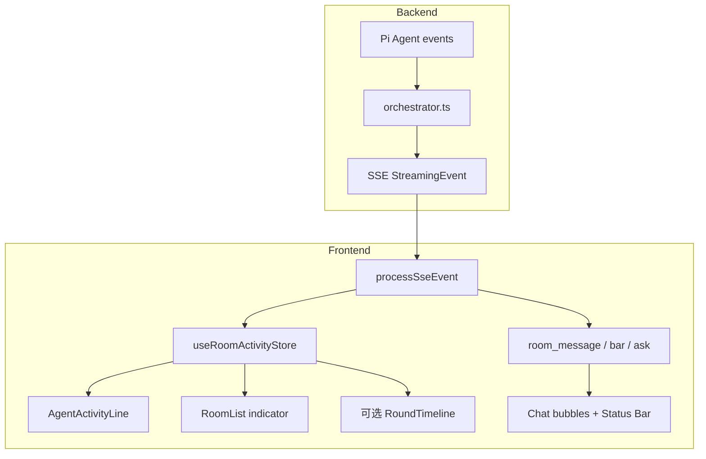

# Agent Activity UI — 设计规格

**版本**：v0.2  
**日期**：2026-07-13  
**状态**：P1 MVP + P1.5 已落地；P2（Card / 空占位优化 / 侧栏指示）进行中  
**参考**：[different-ai/openwork](https://github.com/different-ai/openwork)（Electron + React Activity 方案）、Pi Agent TUI / coding-agent `renderCall`

---

## 1. 问题陈述

当前用户在点击 **Speak** 或 **Auto-Dialogue** 后，往往只能看到一个**空的流式占位气泡**（`stream-*`），直到 `room_message` 旁路插入真实消息，或 `final` 时占位被替换/删除。期间 Agent 可能在：

- 推理（thinking）
- 调用 `write_to_room` / `patch_room` / `write_to_bar`
- 调用 `ask_user` 等待玩家
- 流式输出 `delta` 旁白

**后端已通过 SSE 发出 `tool_call_start` / `tool_call_update` / `tool_call_end`**，但前端 `chat-layout.tsx` 的 `processSseEvent` 几乎未消费这些事件（`tool_call_end` 仅触发 `loadVariables()`）。

叙事 Agent 与 Coding Agent 的关键差异：**正文常通过 Tool 副作用写入消息流**，而非气泡内的 `delta`。因此 UI 必须 **双轨反馈**：

1. **Activity 层** — 「Agent 正在做什么」（状态机 + 人类可读标签）
2. **副作用层** — 消息插入、形势栏更新、Ask 侧栏（已有，需与 Activity 串联）

---

## 2. 三个产品问题的结论

| # | 问题 | 结论 |
|---|------|------|
| 1 | 前端是否需要知道 Agent 具体状态？ | **需要**，但是 **产品级阶段状态**，不必暴露 Pi 内部 turn / 完整 tool JSON |
| 2 | 应向用户展示什么？ | **短标签 + 可选展开**；副作用即时可见；默认不堆原始 `args` |
| 3 | 如何借鉴 Pi TUI / OpenWork？ | **事件驱动状态机 + per-tool 文案函数 + 三层 UI**；不嵌入 `pi-tui` |

---

## 3. 参考实现对照

### 3.1 Pi Agent / coding-agent（TUI）

| 概念 | 行为 |
|------|------|
| 事件 | `tool_execution_start/update/end`，可与 `thinking_*`、`text_delta` 交错 |
| Tool 文案 | 每 Tool 可选 `renderCall` / `renderResult` |
| 展示 | Transcript 内 **独立 Tool 行**，非混在 assistant 气泡 |

### 3.2 OpenWork（Web，推荐对标）

仓库：`different-ai/openwork`（`apps/app/src/...`）

| 层级 | 文件 | 职责 |
|------|------|------|
| 会话状态机 | `session-activity-store.ts` | Zustand：`idle \| thinking \| responding \| waiting \| compacting \| error` |
| 事件同步 | `session-sync.ts` | OpenCode SSE → 更新 store + React Query transcript |
| Tool 文案 | `tool-activity.ts` | `getToolActivityLabel` / `getActiveToolLabel` |
| Tool 解析 | `parse-tool-parts.ts` | 参数未齐时 **defer**，避免闪空 Tool 行 |
| 空会话等待 | `session-surface.tsx` | `AssistantWaitingCard` + 乐观 `awaitingAssistantBaseline` |
| 流式底部 | `message-list.tsx` | `LoadingMessage` + `liveActionLabel` |
| 历史内嵌 | `tool.tsx` + `chat/utils.ts` | 可折叠 Tool 行 |
| 侧边栏 | `app-sidebar.tsx` | `SessionStatusIndicator` spinner / 色点 |

OpenWork 状态推导优先级（`statusForRecord`）：

```
error > waiting > compacting > (runActive ? (assistantOutput ? responding : thinking) : idle)
```

### 3.3 AI Tea Party 现状

| 能力 | 现状 |
|------|------|
| SSE `tool_call_*` | 主流程 ✅ 发出；**Resume 路径丢弃**（`orchestrator.ts` L687–690） |
| 前端消费 | ❌ 未处理 `tool_call_start/update` |
| Tool `label` | ✅ `orchestrator.ts` `createTools()` 已定义 |
| 副作用 | ✅ `room_message` / `message_patch` / `bar_update` / `ask_*` |
| Thinking | ❌ 未转发 `thinking_*` |

---

## 4. 目标架构



**原则**：

- Activity 状态 **不写入** `messages` 表；仅内存 / 可选 debug 面板
- 叙事 **正文** 仍以 `room_message` 为准；`delta` 流仅作补充旁白
- 与 OpenWork 一致：**乐观 UI**（用户点 Speak 后立即 `thinking`，不等首个 SSE）

---

## 5. 会话级状态机

### 5.1 状态枚举

```typescript
/** 房间级 Agent 活动状态（对标 OpenWork SessionActivityStatus，叙事向微调） */
export type RoomActivityStatus =
  | "idle"           // 无进行中的 generate/resume
  | "thinking"       // run 中，尚无可见输出（无 delta、无本轮副作用）
  | "acting"         // run 中，有 tool 在执行（比 OpenWork responding 更贴切叙事）
  | "streaming"      // run 中，气泡内有 delta 打字（可选与 acting 合并为 responding）
  | "awaiting_user"  // ask_user 挂起，等玩家抉择
  | "error";         // 本轮失败
```

**推荐对外合并**（MVP）：`thinking | acting | awaiting_user | error | idle`。  
若 `delta` 与 tool 可并行，UI 优先显示 **acting 的 tool 标签**（更具体），底部文案见 §7。

### 5.2 状态记录（Store 形状）

```typescript
type RoomActivityRecord = {
  status: RoomActivityStatus;
  requestId: string | null;
  characterId: string | null;
  characterName: string | null;
  runActive: boolean;
  hasVisibleOutput: boolean;   // 本轮是否已有 delta / room_message / patch / bar
  currentTool: string | null;
  currentToolLabel: string | null;
  toolStartedAt: number | null;
  errorMessage: string | null;
  /** 本轮 tool 轨迹（可选，供时间线） */
  toolSteps: Array<{
    tool: string;
    label: string;
    startedAt: number;
    endedAt?: number;
    summary?: string;
  }>;
  updatedAt: number;
};
```

建议路径：`frontend/lib/room-activity-store.ts`（Zustand，按 `roomId` 分片）。

### 5.3 状态推导函数

```typescript
function deriveStatus(record: RoomActivityRecord): RoomActivityStatus {
  if (record.errorMessage) return "error";
  if (!record.runActive) return "idle";
  if (record.status === "awaiting_user") return "awaiting_user";
  if (record.currentTool) return "acting";
  if (record.hasVisibleOutput) return "streaming"; // 或保持 acting
  return "thinking";
}
```

---

## 6. 状态转移表

图例：**E** = SSE/用户事件，**A** = 触发的 Action，**S** = 下一状态

### 6.1 主表

| 当前状态 | 事件 (E) | 条件 | 动作 (A) | 下一状态 (S) |
|----------|----------|------|----------|--------------|
| `idle` | 用户点击 Speak / Auto | — | `startRun(character)`；插入占位可选 | `thinking` |
| `idle` | Resume 流开始 | — | `startRun` | `thinking` |
| `thinking` | `tool_call_start` | `args` 可摘要 | `setTool(name, label)` | `acting` |
| `thinking` | `tool_call_start` | `args` 为空 | defer 展示（见 §6.3） | `thinking` |
| `thinking` | `delta` | — | `markVisibleOutput` | `streaming` |
| `thinking` | `room_message` | — | `markVisibleOutput` | `acting`→`idle` 子步骤* |
| `acting` | `tool_call_update` | — | `updateToolProgress` | `acting` |
| `acting` | `tool_call_end` | — | `clearCurrentTool`；`pushToolStep` | `thinking` 或 `streaming`** |
| `acting` | `room_message` / `message_patch` / `bar_update` | — | 副作用 UI 已有；`markVisibleOutput` | `acting` |
| `acting` | `delta` | — | `markVisibleOutput` | `streaming` |
| `streaming` | `tool_call_start` | — | `setTool` | `acting` |
| `streaming` | `delta` | — | enqueue 打字机 | `streaming` |
| `*` | `ask_pending` | — | 打开 Ask 数据 | 保持，`awaiting_user` 预备 |
| `*` | `awaiting_user` | — | `setAwaitingUser`；移除占位气泡 | `awaiting_user` |
| `awaiting_user` | 用户提交 Ask + 新 resume 流 | — | `startRun` | `thinking` |
| `*` | `error` | — | `setError`；停打字机；移除占位 | `error` |
| `*` | `final` | 非 awaiting | `endRun` | `idle` |
| `error` | 用户重试 Speak | — | `clearError`；`startRun` | `thinking` |
| `acting` | `final` | 无 awaiting | `endRun` | `idle` |

\* `room_message` 在 acting 期间不改变顶层状态，但标记 `hasVisibleOutput`。  
\*\* `tool_call_end` 后若仍有 `runActive` 且无新 tool，回 `thinking`；若已有 delta 则 `streaming`。

### 6.2 与 OpenWork 映射

| OpenWork | AI Tea Party |
|----------|--------------|
| `thinking` | `thinking` |
| `responding` | `streaming` 和/或 `acting` |
| `waiting` (permission/question) | `awaiting_user` |
| `compacting` | （后续）archive/compact 时可加 `compacting` |
| `error` | `error` |
| `getActiveToolLabel` | `getToolActivityLabel(tool, args)` |

### 6.3 Defer 规则（来自 OpenWork `parse-tool-parts`）

当 `tool_call_start` 的 `args` 为空对象或缺少摘要关键字段时：

- **不更新** `currentToolLabel`（避免闪「正在写入房间…」却无内容）
- 等到 `args` 非空或 `tool_call_update` / `room_message` 到达再展示

### 6.4 乐观转移（本地，无 SSE）

| 触发 | 动作 | 状态 |
|------|------|------|
| `handleAISpeech` 调用瞬间 | `store.startRun({ characterId, characterName })` | `thinking` |
| `consumeSseResponse` 结束且无 `final` / `error` | `store.endRun()` | `idle` |
| 切换房间 | `store.reset(roomId)` 或保留上次快照 | — |

---

## 7. SSE 事件 → Store 映射

现有契约：`packages/shared/src/index.ts` → `StreamingEventSchema`

| SSE `type` | Store 更新 | UI 副作用（已有） |
|------------|------------|-------------------|
| `delta` | `markVisibleOutput`；可选 `streaming` | 打字机 `enqueue` |
| `tool_call_start` | `setTool(tool, summarizeArgs)` | Activity 文案 |
| `tool_call_update` | `setToolProgress` | 可选进度 |
| `tool_call_end` | `clearTool`；`loadVariables` | 变量面板刷新 |
| `room_message` | `markVisibleOutput` | `appendRoomMessage` |
| `message_patch` | `markVisibleOutput` | `handleMessagePatch` |
| `bar_update` | `markVisibleOutput` | `setRoomBar` |
| `ask_pending` | — | `loadPendingAsk` |
| `awaiting_user` | `setAwaitingUser` | 移除占位气泡 |
| `final` | `endRun` | 替换 `stream-*` id |
| `error` | `setError` | 移除占位 |

### 7.1 后端待修复

| 项 | 位置 | 说明 |
|----|------|------|
| Resume 路径转发 tool 事件 | `orchestrator.ts` ~687–690 | 与主流程一致 emit `tool_call_*` |
| 可选 `activity` 聚合事件 | `packages/shared` | 减轻前端状态机；**非 MVP 必须** |
| 可选 `thinking_*` | `orchestrator.ts` | Phase 2；MVP 用 `thinking` 即可 |

---

## 8. Tool 人类可读文案

对标 OpenWork `tool-activity.ts`。实现：`frontend/lib/tool-activity.ts`（或 `packages/shared` 若需 SSR 复用）。

| `tool` | `label`（后端已有） | `getToolActivityLabel(args)` 示例 |
|--------|---------------------|-----------------------------------|
| `write_to_room` | 写入房间消息 | `正在写入房间…` / `写入：{content 前 24 字}` |
| `patch_room` | 修改房间消息 | `正在修订文稿…` |
| `write_to_bar` | 更新形势栏 | `正在更新当前形势…` |
| `ask_user` | 询问玩家 | `等待你的抉择…` |
| `read_*` / 变量类 | （若有） | `正在读取…` / `正在更新变量…` |
| 未知 | `Running {tool}` | 降级 |

```typescript
export function summarizeToolArgs(
  tool: string,
  args: Record<string, unknown>,
): string | null {
  if (tool === "write_to_room" && typeof args.content === "string") {
    const t = args.content.trim();
    return t ? t.slice(0, 24) + (t.length > 24 ? "…" : "") : null;
  }
  // patch_room, write_to_bar, ...
  return null;
}

export function getToolActivityLabel(
  tool: string,
  args?: Record<string, unknown>,
  fallbackLabel?: string,
): string {
  const summary = args ? summarizeToolArgs(tool, args) : null;
  // 返回中文产品文案，见上表
}
```

---

## 9. UI 三层（书卷风）

对标 OpenWork，用本项目视觉语言（卷轴、墨色、脉冲字），**不**照搬 `PaperGrainGradient`。

### 9.1 层 A — 空转 / 首屏等待

**组件**：`AgentActivityCard`（对标 `AssistantWaitingCard`）

- 显示时机：`messages` 无本轮输出 && `status !== idle`
- 文案：`{characterName}正在构思…` / `getSessionActivityStatusLabel(status)`
- 位置：聊天区居中或占位气泡内文案

### 9.2 层 B — 流式底部状态行

**组件**：`AgentActivityLine`（对标 `LoadingMessage`）

- 显示时机：`runActive && status !== idle && status !== awaiting_user`
- 文案优先级：`currentToolLabel` > `status` 默认文案
- 位置：消息列表底部（`MessageList` 同级）

示例：

```
◌ 小明正在写入房间…「众人行至破庙门前…」
```

### 9.3 层 C — 本轮行动时间线（可选，Phase 2）

**组件**：`RoundActivityTimeline`

- 折叠展示 `toolSteps`
- 叙事产品可只做一行摘要，不展开 JSON

### 9.4 层 D — 侧边栏 / 房间列表

- 房间或角色行上的小圆点 / 脉冲（对标 `SessionStatusIndicator`）
- Auto-Dialogue 进行中时与 Speak 共用同一 store

### 9.5 与占位气泡的关系

| 场景 | 行为 |
|------|------|
| 仅 tool、无 delta | 占位气泡显示「落笔中…」或隐藏空气泡，以 `AgentActivityLine` 为主 |
| 有 `room_message` | 旁路消息为主；占位可在 `final` 时删除 |
| `awaiting_user` | 移除占位；侧栏 Ask 为主 |

---

## 10. 前端文件与 API 草案

### 10.1 新增

| 文件 | 说明 |
|------|------|
| `frontend/lib/room-activity-store.ts` | Zustand store |
| `frontend/lib/tool-activity.ts` | 文案与 args 摘要 |
| `frontend/components/chat/agent-activity-line.tsx` | 底部状态行 |
| `frontend/components/chat/agent-activity-card.tsx` | 空态等待卡 |
| `frontend/hooks/use-room-activity.ts` | 选择器 hook |

### 10.2 修改

| 文件 | 说明 |
|------|------|
| `frontend/components/chat/chat-layout.tsx` | `processSseEvent` 接 `tool_call_*`；Speak 乐观 `startRun` |
| `frontend/components/chat/chat-bubble.tsx` 或等价 | 空占位文案 |
| `frontend/components/sidebar/*` | 可选活动指示点 |

### 10.3 Store API

```typescript
interface RoomActivityStore {
  getRecord(roomId: string): RoomActivityRecord;
  startRun(roomId: string, input: { requestId?: string; characterId: string; characterName: string }): void;
  setTool(roomId: string, tool: string, args: Record<string, unknown>): void;
  clearTool(roomId: string): void;
  markVisibleOutput(roomId: string): void;
  setAwaitingUser(roomId: string, askId: string): void;
  setError(roomId: string, message: string): void;
  endRun(roomId: string): void;
  reset(roomId: string): void;
}
```

### 10.4 `processSseEvent` 伪代码

```typescript
case "tool_call_start":
  activity.setTool(roomId, parsed.tool, parsed.args);
  break;
case "tool_call_update":
  activity.setToolProgress(roomId, parsed.progress);
  break;
case "tool_call_end":
  activity.clearTool(roomId);
  void loadVariables();
  break;
case "delta":
  activity.markVisibleOutput(roomId);
  enqueue(tempId, parsed.content);
  break;
// room_message, bar_update, ... 各 markVisibleOutput
case "awaiting_user":
  activity.setAwaitingUser(roomId, parsed.ask_id);
  // existing...
case "final":
  activity.endRun(roomId);
  break;
case "error":
  activity.setError(roomId, parsed.message);
  break;
```

---

## 11. 实施阶段

| Phase | 内容 | 验收 |
|-------|------|------|
| **P0 规格** | 本文档 | PR review |
| **P1 MVP** | Store + `processSseEvent` + `AgentActivityLine` + 乐观 `thinking` | ✅ Speak 时可见「正在写入房间…」 |
| **P1.5** | Resume 路径 `tool_call_*` | ✅ Ask 恢复后 Activity 正常 |
| **P2** | `AgentActivityCard`、空占位优化、侧边栏指示 | ✅ 无空气泡困惑；角色行活动点 |
| **P3** | `RoundActivityTimeline`、developer 展开 args | 可选 |
| **P4** | `thinking_*` SSE、`compacting` 状态 | 推理模型 / Compact 时 |

---

## 12. 测试计划

| 用例 | 步骤 | 期望 |
|------|------|------|
| Speak + write_to_room | 点 Speak | 先「构思」→「写入房间」→ 消息出现 → idle |
| 仅 delta 无 tool | 模型直接流式 | 「构思」→ 打字机 → idle |
| Ask 挂起 | Agent ask_user | 「等待抉择」→ 侧栏 → resume 后恢复 |
| Auto-Dialogue | 自动连播 | 多轮 Activity 不串台（按 roomId） |
| 切房间 | 活动中切换 | 旧 room reset 或保留只读快照 |
| Resume tool 事件 | Ask 后 resume | P1.5 后与主流程一致 |

E2E：可在 `frontend/e2e` 断言 `data-testid="agent-activity-line"` 文案变化（实现时加 testid）。

---

## 13. 相关代码索引（本仓库）

| 路径 | 说明 |
|------|------|
| `packages/shared/src/index.ts` | `StreamingEventSchema` |
| `backend/src/services/orchestrator.ts` | Pi 事件 → SSE；`createTools()` labels |
| `frontend/components/chat/chat-layout.tsx` | `processSseEvent` / `consumeSseResponse` |
| `docs/plans/agent-platform-roadmap.md` | 平台总路线图 |

---

## 14. 修订记录

| 日期 | 版本 | 说明 |
|------|------|------|
| 2026-07-13 | v0.2 | P2：Card / 空占位 / 侧栏指示 / setToolProgress；状态同步 |
| 2026-06-21 | v0.1 | 初稿：状态机、转移表、OpenWork/Pi 对照、实施阶段 |
